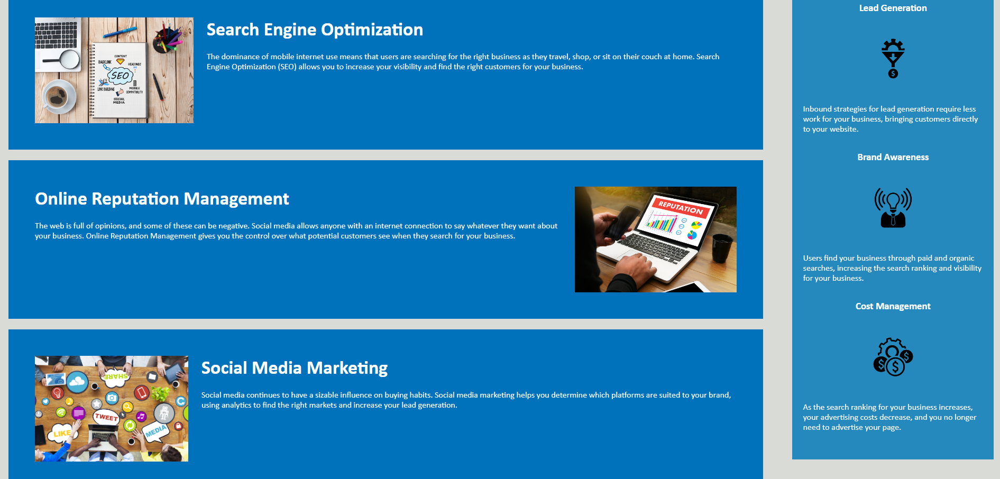

# c01-accessibility-refactor
Accessibility refactor for Horizon

## Description

This webpage is the first homework assignment for the NW Bootcamp I'm currently attending. The intent is to show the importance of alt text for images and to reduce the redundencies in the code provided. I learned how to write alt text for images that are being referenced exclusively from a .css file, and reinforced other topics we've learned so far.

## Table of Contents (Optional)

N/A

## Installation

N/A

## Usage

This application is a webpage about digital marketing strategies and their benefits.

## Credits

Ian Wolfe & Bryan Lebeuf

## License

N/A

## Badges

N/A

## Features

Non-stop, action packed information on the wonders of digital marketing and all of its boons.

## How to Contribute

This is a project done for NWBootcamp.

## Tests

Regurgitate what you read here to a digital marketing expert for best testing results.